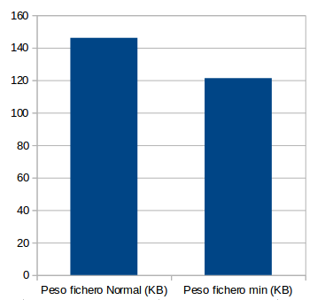
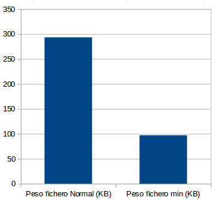
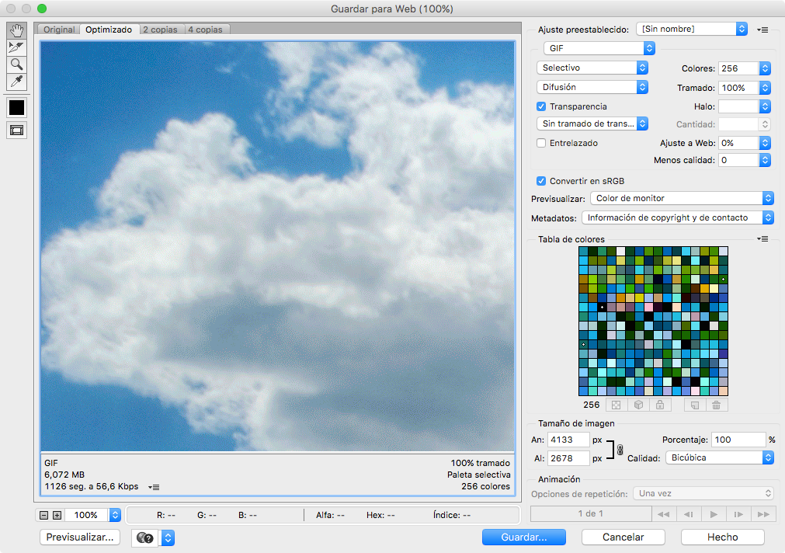
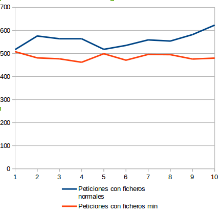
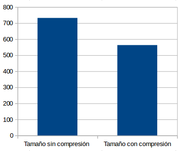
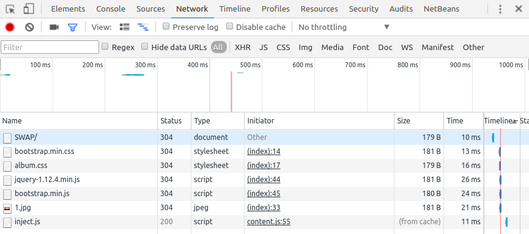

#Trabajo SWAP: Optimización, recomendaciones y herramientas de análisis de sitios webs.

     

##1. Introducción: 

El objetivo de este trabajo es el la optimización de páginas webs pesadas. Para las pruebas, ha sido creada una página web pesada con imágenes de mucho peso, ficheros javascript, css, etc.

	

Durante este trabajo se enumeran diferentes buenas prácticas para la optimización en la carga de sitios webs pesados, mostrando sus diferencias y progresos en tiempos de carga de la página web así como la experiencia del usuario.

También se van a realizar algunas optimizaciones en el servidor apache que utilizaremos durante este trabajo.

##2. Buenas prácticas:

Aunque en las fechas en las que nos encontramos la velocidad de descarga de internet no tiene nada que ver con lo que era hace unos años, las webs de hoy en día cada vez tienen más contenido visual , lo cual hace que tenga una mayor demora a la hora de poder visualizar la página web. En este apartado se redactarán algunas de las buenas prácticas más utilizadas para que un sitio web sea más óptimo, y cargue más rápido. Como norma general un sitio web no puede tardar más de 5 segundos en cargar, una web lenta puede desesperar al usuario que la está visualizando y por lo cual la abandonará. 

###Ficheros min.css

Los ficheros min.css son ficheros normales y contienen la  misma funcionalidad, pero en ellos se han eliminado todos los espacios en blanco posibles. Con esto conseguimos ficheros de menor tamaño que harán que la carga de la web sea más corta.

Os mostramos un diagrama de un ejemplo de css normal y un css minimizado, en este caso, el css de Bootstrap:

###Ficheros min.js

Los ficheros min.js al igual que los anteriores css, están optimizados, consiguiendo una reducción de espacio considerable.

A continuación podemos ver un diagrama que lo demuestra:

###Orden correcto de los archivos JavaScript: Por ejemplo, si tengo un archivo como boostrap.js que utiliza la librería jquery.min.js , es recomendable poner antes la librería de jquery para que no tenga que volver atrás para cargar el archivo, son milésimas de segundo, pero en la optimización todo cuenta.

Otras veces, si por ejemplo el archivo js que queremos cargar tarda bastante en cargar y no se va a utilizar inmediatamente, se puede poner al final del código de la web para que se cargue el último cuando la web ya esté cargada visualmente, esto posibilitará la disminución de los tiempo de carga en archivos javascript pesados que no vayamos a utilizar en ese momento.

###Evitar css o js duplicado

Siempre se ha de evitar insertar en las páginas webs el menor número de ficheros css o js que sean prescindibles, estos ficheros aunque no se utilicen, serán descargados y afectarán a los tiempos de carga de la página y a la carga del servidor, incluso si se encuentran duplicados dentro de la página lo volvería a cargar, por eso es aconsejables revisar el proyecto y no tener estos archivos duplicados.

-Evitar redirecciones de archivos : Imagínate que tienes imágenes de tu servidor que se muestran en otras páginas que no son las tuyas, pues bien , esa imagen que se muestra en otra página que no es tuya , está utilizando tu servidor para poder visualizar la imágen de esa página, se recomienda encarecidamente evitar que puedan ver las imágenes u otros archivos fuera de tu página, para ello se utiliza el .htaccess,el .htaccess es un archivo que permite configurar las directivas donde está alojada la web restringiendo con permisos las imágenes para que no puedan ser visualizadas fuera de nuestra web.

-También es recomendable utilizar tanto archivos css como js que sean propios. Primero porque tienes que tener cuidado con que ese archivo externo no lo modifique el propio autor, eso podría cambiar las cosas en tu web y por otro lado, estas librerías externas no se guardan en la  caché y eso nos limitaría a no poder utilizarlos y tener que cargarlos cada vez que se inicia la web de nuevo**.**

###Caché: 
Una de las formas más efectivas a la hora de optimizar tu página web es utilizar la caché. La caché permite guardar los archivos más pesados en tu navegador web optimizando los tiempos de carga de tu página web. Como pega ,se le puede poner que debes de tener bien controlados los archivos que se almacenarán en la caché, ya que si realizas algún cambio en ellos, y un usuario había entrado en la web, esos cambios no los verá a no ser que borre la caché del navegador. Para que esto no ocurra comentaré a continuación algunos métodos de buenas prácticas para que estos cambios hagan efecto en los usuarios que hayan accedido en la web y hayan guardado los datos en la caché. 

Cuando realicemos cambios en un archivo js, para que el usuario descargue el nuevo archivo js que hemos modificado podemos versionar el nombre del fichero para que el usuario que visualiza la web no utilice el archivo en caché, sino el nuevo, para ello una buena forma es hacerlo así: 

			<link href="css/style.css?v=1.2” rel=”stylesheet”>

		Esto se puede utilizar tanto para archivos css, como para archivos js.

Otra recomendación es establecer en la web un período de vaciado de caché, para que los archivos de la caché se actualicen .

###Imágenes: 
Una de las partes de la web que emplea más tiempo en cargar son las imágenes , ya que en ocasiones son archivos de gran tamaño, para ello hay varias formas de optimizar las imágenes.

####Optimizacion ps

La famosa herramienta Phostoshop viene con la opción de exportación web, para ello una vez tengamos la imagen , pulsamos en Archivo - Guardar para web y nos aparecerá la siguiente ventana:

-Voy a comentar un caso práctico, imaginemos que tenemos una imagen como la de imagen anterior, si nos damos cuenta tiene una resolución de 4133 x 2678 px, cuanta más resolución , más pesa el archivo. Pues bien podemos poner el porcentaje que nos interese y la imagen se redimensionará a un tamaño más pequeño sin perder la escalabilidad .

-Otra opción interesante siempre es el tipo de archivo,cada tipo de archivo se tendrá unas propiedades diferentes : 

#####Formato.png : 
Se utiliza sobretodo para las imagenes que estan hechas con formas geométricas y tiene colores planos. La gran ventaja de este formato es que conserva las transparencias y que no pierde mucha calidad en la comprensión de la imagen , por eso se utiliza en logotipos e imágenes que necesariamente tenga una gran calidad, pero para optimizar la web, cuanto menos se utilice mejor.

#####Formato .jpg: 
Es el formato universal que se utiliza sobre todo para las imágenes, pues aunque se pierde un poco de calidad al comprimir las imágenes, no se pierden colores o tonalidades, es el más recomendado a la hora de tener imágenes optimizadas. 

#####Formato .gif: 
Este formato se utiliza para animaciones sobretodo. Dado que se utilizan varias imágenes o un video para hacer el gif, el tamaño en Kb puede ser muy grande; por eso, en ocasiones se comprime la imagen y pierde calidad.

-Por último también tiene la opción de la calidad, podemos seleccionar la calidad de la imagen que queremos, cuanta menos calidad, menos pesara la foto y por consiguiente mas rapido cargara nuestra página web.  

###optimizacion con smug.io:

Esta herramienta es muy interesante, nos permite pasarle todas las imágenes de nuestra web y nos la redimensiona y optimiza sin perder calidad.

###Optimización del servidor:

####Compresión gzip: 
La compresión Gzip reduce aproximadamente entre un 50% y un 70% el tamaño del archivo, lo que significa menos tiempo en cargar las páginas y menos ancho de banda consumido por el servidor.

####consultas optimizadas:

Una práctica habitual es realizar consultas al servidor optimizadas, evitando las mínimas subconsultas dentro de las consultas, se recomienda utilizar más los inner-join. Realizar consultas eficientes aumentará la velocidad de consulta de la base de datos.

####Cache del servidor: 
Como he comentado antes, es muy recomendable realizar las consultas de base de datos lo más optimizadas posible,en Mysql por ejemplo podemos habilitar la caché de consultas para aumentar el rendimiento del servidor de la base de datos. Cada vez que la caché de consultas está activada, esta puede cachear o mantener la consulta en la memoria incrementando de esta forma el rendimiento.

###Casos de éxito:

####Tiempos de carga de la página con ficheros css y js normales vs ficheros min:

Se muestra a continuación una gráfica de unas pruebas de carga de la página de prueba:

####Habilitar la compresión en el servidor apache:

Habilitar la compresión en el servidor apache nos puede ayudar a liberar carga de red del servidor y mejorar los tiempos de descarga de una página web, mejorando la experiencia del usuario.

###Herramientas de monitorización y prueba de páginas webs:

####Herramienta para desarrolladores de Google Chrome:

La herramienta para desarrolladores de Google Chrome es una herramienta muy útil para los desarrolladores de páginas webs, pero también es una herramienta muy útil para los administradores de servidores web.

Esta herramienta nos permite ver los tiempos de carga, renderización, tamaños y formatos de los paquetes de una página web. 

	Con esta información, si tenemos una página web con mucha carga y con tiempos de carga muy altos, podemos ver el origen o los orígenes de los problemas para poder optimizarlos paso a paso, como por ejemplo, intentar prescindir de ficheros que sean prescindibles sacrificando algo que no sea tan importante para la página o intentar optimizarlos para que bajen los tiempos de carga y procesado.

