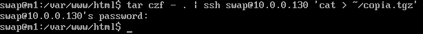
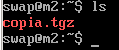
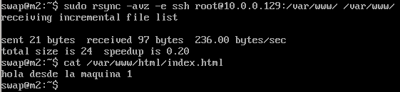
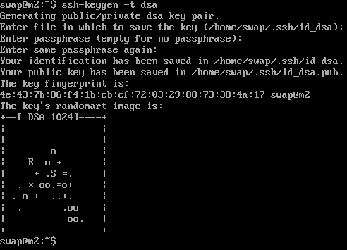
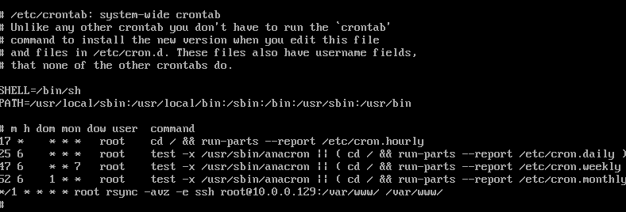
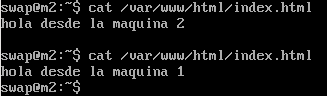

#Práctica 2 SWAP
##1 Copiado de archivos por ssh:

Para copiar archivos entre dos máquinas por ssh, podemos ejecutar el siguiente comando: 

$tar czf - . | ssh swap@10.0.0.130 'cat > ~/copia.tgz'

Este comando, comprime los ficheros del directorio actual y lo copia en el directorio home del usuario swap de la máquina 10.0.0.130 con el nombre 'copia.tgz'

Y ahora podemos ver en la máquina 2 el fichero creado:

##2 Clonado de carpeta con rsync:

Otra de las opciones para clonado de carpetas entre dos máquinas es la herramienta rsync.

Para instalar esta herramienta, ejecutaremos el siguiente comando en la máquina 2:

$sudo apt-get install rsync

Ahora, desde la máquina 2 podemos ejecutar el siguiente comando:

$rsync -avz -e ssh root@10.0.0.129:/var/www/ /var/www/

Este comando, sincronizará la carpeta /var/www/ de la primera máquina con ip 10.0.0.129, dentro del directorio /var/www/ de la máquina desde donde se está ejecutando el comando.

##3 Acceso sin contraseña para ssh:

Este tipo de tareas se suelen realizar muchas veces, para ello, es útil configurar el acceso de ssh sin contraseña. Esto nos permitirá realizar las copias de archivos sin necesidad de introducir la contraseña, en este caso vamos a hacer que la máquina 2 pueda acceder a la máquina 1 sin contraseña.

Para ello, debemos seguir los siguientes pasos:

Este comando, generará una clave pública y privada.

A continuación, copiamos la clave en la máquina 1 con el siguiente comando:

Y como se puede apreciar, después del copiado de la clave, ya podemos accceder por ssh sin que nos pida la contraseña.

##4 Programar tareas con crontab:
Muchas veces es necesario realizar sincronizaciones automáticas entre dos máquinas, este proceso se puede realizar con facilidad con la herramienta cron, la cual nos permite programar tareas para que se ejecuten según nosotros le indiquemos.

Vamos a configurar en la máquina 2, que cada minuto sincronice la carpeta /var/www de la máquina 1 en el directorio /var/www de la máquina 2, para ello editamos el fichero /etc/crontab y añadimos la siguiente línea:

*/1 * * * * root rsync -avz -e ssh root@10.0.0.129:/var/www/ /var/www/

El fichero quedará de la siguiente forma:

Una vez realizado esto, vamos a ver el contenido del fichero /var/www/html/index.php de la máquina 2 y vamos a ver como sin ejecutar ningún otro comando, el contenido cambia ya que se ha copiado el fichero de la máquina 1:

