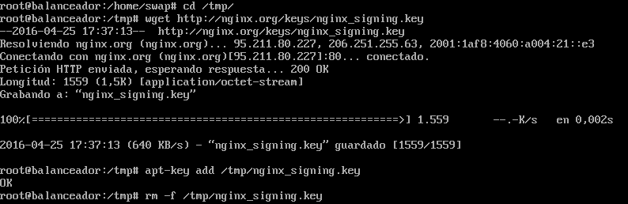
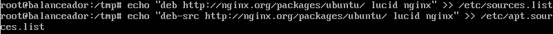
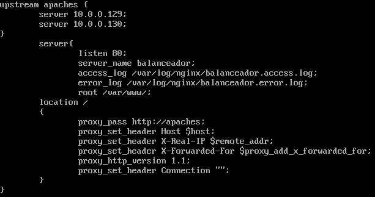
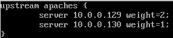
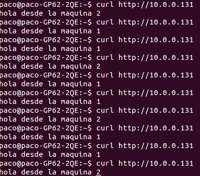
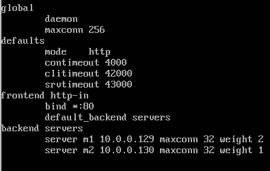
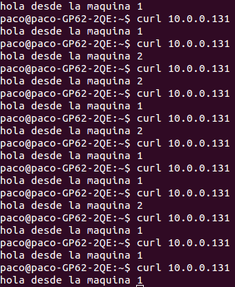

#Práctica 3 SWAP
##3.1 Nginx:

###3.1.1 Instalación de Nginx:

Para la instalación de Nginx, vamos a importar la clave del repositorio con los siguientes comandos:

A continuación, añadimos el repositorio al fichero /etc/apt/sources.list tal y como se ha hecho en la siguiente caputura:

Una vez realizado esto, podemos ejecutar los comandos:

$ sudo apt-get update
$ sudo apt-get install nginx

Una vez ejecutados estos comandos, tendremos instalado Nginx en nuestro servidor destinado a balancear la carga de nuestra granja web.

###3.1.2 Configuración de Nginx:

Para configurar nginx debemos de modificar el fichero de configuración /etc/nginx/conf.d/default.conf. Elinimamos el contenido y escribimos la siguiente configuración tal y como se puede ver en la siguiente captura.

En upstream apaches debemos configurar poner las direcciones ips de los servidores web de nuestra granja web. En esta ocasión las ips eran 10.0.0.129 y 10.0.0.130.

A continuación vamos a suponer que el servidor 1 tiene el doble de capacidad que el 2, para balancear correctamente la carga entre los dos servidores, vamos a colocar el parámetro "weight" junto con un valor para darles diferentes cargas a ambos equipos.

Una vez realizado esto, ya tendremos configurado nuestro balanceador de carga con Nginx:

###3.1.3 Resultados:

Una vez realizado los pasos anteriores, tendremos nuestro balanceador de carga con Nginx que repartirá el tráfico entre ĺos servidores de nuestra granja web.

Para este ejemplo, hemos supuesto que el servidor 1 tiene el doble de capacidad que el 2, y nuestro balanceador de carga debe repartir el trabajo respecto a esos valores que le hemos indicado anteriormente.

Para la correcta visualización del reparto de carga, hemos colocado dos webs pŕacticamente idénticas en ambos servidores pero don distinto número tal y como se puede ver en la siguiente captura:

Como se puede apreciar, el servidor 1 recibe el doble de carga que el servidor 2, tal y como hemos configurado en el apartado 3.1.2.

##3.2 Haproxy:

###3.2.1 Instalación de Haproxy:

Para la instalación de Haproxy solo tendremos que ejeuctar el siguiente comando:

$ sudo apt-get install haproxy

###3.2.2 Configuración de Haproxy:

Para configurar haproxy tendremos que modificar el archivo /etc/haproxy/haproxy.cfg tal y como aparece en la siguiente captura:

En esta configuración, hemos configurado los servidores m1 y m2 con sus respectivas direcciones ip y un valor weight para el servidor m1 de 2 y 1 para el servidor m2, para que el servidor m1 atienda el doble de peticiones que el servidor m2.

###3.2.3 Resultados:

Una vez configurado haproxy podemos iniciar el haproxy con el siguiente comando:

$ sudo /usr/sbin/haproxy -f /etc/haproxy/haproxy.cfg

Y ahora ver en la siguiente captura el reparto de solicitudes a nuestra granja web:

Tal y como podemos ver en la captura anterior, el servidor m1 atiende 8 peticiones y el servidor m2 atiende 4 solicitudes, tal y como configuramos en el fichero de configuración.