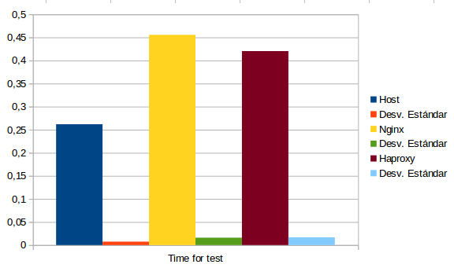

#Práctica 4 SWAP:

Antes de empezar con las pruebas de rendimiento, vamos a asegurarnos que los balanceadores de carga Nginx y HaProxy están configurados para darle la misma carga a los dos servidores web.

Una vez hecho esto, podemos proceder con las pruebas de rendimiento.

##4.1 Pruebas de rendimiento:

Para las pruebas de rendimiento de nuestra granja web hemos utilizado las herramientas Apache Benchmark y Siege.

Con Apache Benchmark se han realizado 1000 peticiones en bloques de 5, y con Siege se han realizado peticiones de 5 segundos.
Todas estas mediciones han sido guardadas en una hoja de cálculo y calculadas la media y la desviación estándar de el tiempo en realizar el test y peticiones por segundo.

No se han realizado gráficas de peticiones fallidas ya que en todas las pruebas no han existido.

###4.1.1 Time for test Apache Benchmark:

###4.1.2 Requests per second Apache Benchmark:

###4.1.3 Time for test Siege:

###4.1.4 Requests per second Siege:

##4.2 Conclusiones:

Está claro que parte de las gráficas se aleja de los resultados esperados, concretamente, podemos apreciar que haciendo las pruebas de rendimiento a un solo hosts nos da mayor rendimiento, pero esto es debido al entorno en el que nos encontramos y la página a la que se ha realizado la petición, de manera que es menos costoso para el sistema pedir la web a un host sin tener que pasar por un balanceador de carga que pasando por él.

Es de sentido común que si aumentamos la complegida de la web con PHP y una web que requiera más procesamiento en el servidor, se obtendrán mejores resultados con los balanceadores de carga.

También podemos apreciar en las gráficas que entre los balanceadores de carga Nginx y HaProxy, este último es más eficiente, o por lo menos en esta ocasión ha sido capaz de dar mejor servicio que Nginx, ganándole tanto en peticiones por segundo y en tiempo empleado para completar el test.

