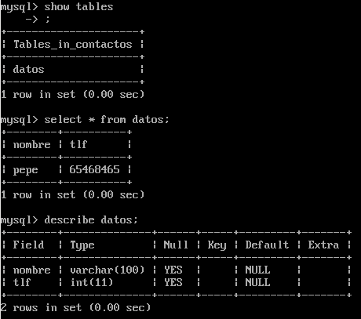
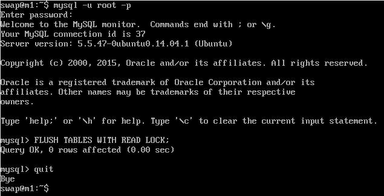
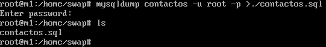
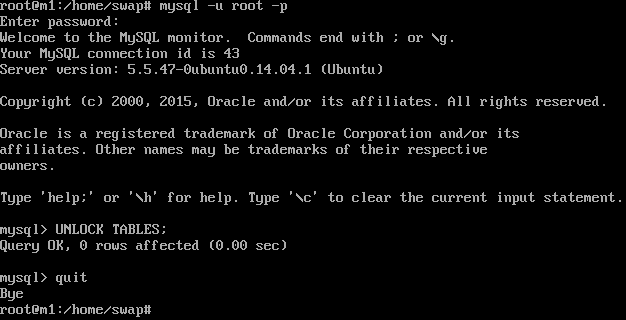
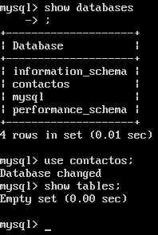
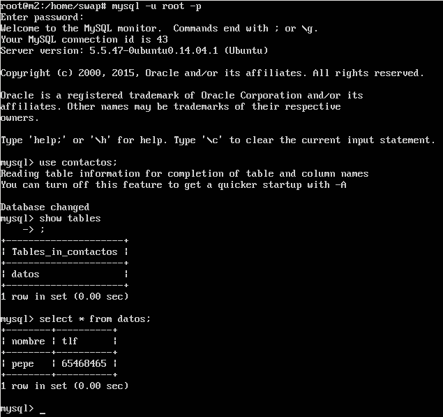

#Práctica 5 SWAP
##5.1 Creación de base de datos:

Para comenzar debemos de crear una base de datos, para ello ejecutaremos el siguiente comando:
```
create database contactos;
use contactos;
```
Ahora vamos a crear la tabla datos con un nombre y un teléfono e insertaremos una fila de datos:

```
create table datos(nombre varchar(100), tlf int);

insert into datos(nombre, tlf) values ("pepe", 654945489);
```
Una vez hecho esto, ya tenemos creada nuestra base de datos de prueba:



##5.2 Realizar la copia de seguridad de la BD completa usando mysqldump:

Para copiar la BD completa ya sea para una copia de seguridad o para replicarla en otro servidor vamos a utilizar mysqldump.

En primer lugar, vamos a evitar que se acceda a la BD para que no se realizen cambios durante la copia de la BD.

Para ello seguiremos los sigiuentes pasos:



Una vez bloqueadas las tablas, procedemos a guardar los datos con mysqldump:



Ya tenemos la copia de la BD, ahora tenemos que desbloquear las tablas que hemos bloqueado antes:



##5.3 Restaurar copia en la segunda maquina:

Para restaurar la copia de la BD de la máquina 1 a la 2, nos vamos a la máquina 2 y creamos la base de datos 'contactos' y con los siguientes comandos podemos ver el estado de la BD de la máquina 2:



A continuación ejecutamos el siguiente comando para traernos a la máquina 2 la BD de la máquina 1 e importamos la BD:

```
scp root@10.0.0.129:/home/swap/contactos.sql /root/

sudo mysql -u root -p contactos < /root/contactos.sql
```
Ahora ya podemos ver el contenido de la BD de la máquina 2 actualizado:



##5.4 Realizar la configuración maestro-esclavo de los servidores MySQL para que la replicación de datos se realice automáticamente:

Para la configuración, nos vamos a la máquina 1 y editamos el archivo /etc/mysql/my.cnf y editamos las siguientes líneas, y si fuese necesario decomentar alguna no existente, la escribimos:

- Comentamos la línea bind-address 127.0.0.1
- Decomentamos la línea log_error = /var/log/mysql/error.log
- Establecemos el identificador del servidor con: server-id = 1
- Configuramos el registro binario con: log_bin = /var/log/mysql/bin.log

A continuación, guardamos el archivo y reiniciamos el servicio con:

```
/etc/init.d/mysql restart
```


