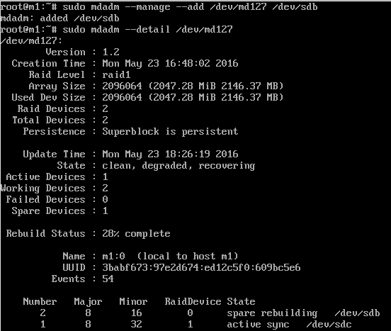

#Práctica 6 SWAP:
##6.1 Configuración de RAID por software:

Para la configuración de RAID por software, partiendo de una máquina virtual con Ubuntu 12.04 con dos discos duros adicionales seguiremos los siguientes pasos:

Instalamos mdadm con el comando:

```
sudo apt-get install mdadm
```

Para ver la configuración de los discos, ejecutamos el comando:

```
sudo fdisk -l
```

Y nos aparecerán los dos discos que hemos creado para la configuración del RAID 1:


Ahora vamos a configurar el RAID 1, usando el dispositivo /dev/md0. Ejecutaremos el siguiente comando:

```
sudo mdadm -C /dev/md0 --level=raid1 --raid-devices=2 /dev/sdb /dev/sdc
```

En este caso, yo he reiniciado la máquina y ahora de llamarse /dev/md0 ha pasado a llamarse /dev/md127.

Para darle formato ext2 ejecutamos el siguiente comando:
```
sudo mkfs /dev/md0
```

A continuación, vamos a crear el directorio donde montar la unidad del RAID:

```
sudo mkdir /dat
sudo mount /dev/md127 /dat
```

Como podemos ver en la siguiente captura, la unidad /dev/md127 está montada en /dat con formato ext2:

```
sudo mount
```


Para ver el estado del RAID, ejecutamos el siguiente comando:

```
sudo mdadm --detail /dev/md127
```
Y nos aparecerá la siguiente información:


Ahora ya solo nos queda configurar el sistema para que monte el RAID al arrancar el sistema, modificando el archivo /etc/fstab, y añadiendo una nueva línea correspondiente para montar automáticamente el dispositivo.

Para averiguar el UUID del disco md127 ejecutamos el siguiente comando:
```
ls -l /dev/disk/by-uuid/
```
Y nos aparecerá una información de este tipo:


Ahora con el UUID, vamos a añadir una línea al fichero /etc/fstab:
```
UUID=69ff65d6-12fb-4250-8363-d4fbd21d0708 /dat ext2 defaults 0 0
```
De manera que el fichero quedará de la siguiente manera:


Guardamos el fichero, reiniciamos el sistema y ya tenemos nuestro sistema RAID configurado para que se monte al inico del sistema.

##6.2 Simulando fallos de los discos del RAID:

Ahora vamos a simular fallos en los discos del RAID:

Vamos a ejecutar el siguiente comando que simulará un fallo en uno de los discos:

```
sudo mdadm --manage --set-faulty /dev/md127 /dev/sdb
```

Y con el comando:
```
sudo mdadm --detail /dev/md127
```
Podemos ver el estado del dispositivo RAID y posteriormente accedemos satisfactoriamente a un fichero del sistema RAID:


A continuación podemos eliminar "en caliente" el disco que está marcado como que ha fallado con el siguiente comando:

```
sudo mdadm --manage --remove /dev/md0 /dev/sdb
```
Y así quedaría el estado del sistema RAID después de eliminar ese disco:


Y por último vamos a volver a añadir al sistema RAID el disco que hemos eliminado anteriormente con el comando:
```
sudo mdadm --manage --add /dev/md127 /dev/sdb
```
Una vez realizado esto, el sistema empezará a reconstruir el sistema RAID. Si comprobamos el estado del sistema RAID, podemos ver el estado de la reconstrucción:



Una vez finalizada la reconstrucción, podemos ver el estado final del sistema RAID totalmente operativo y accediendo a sus archivos:


